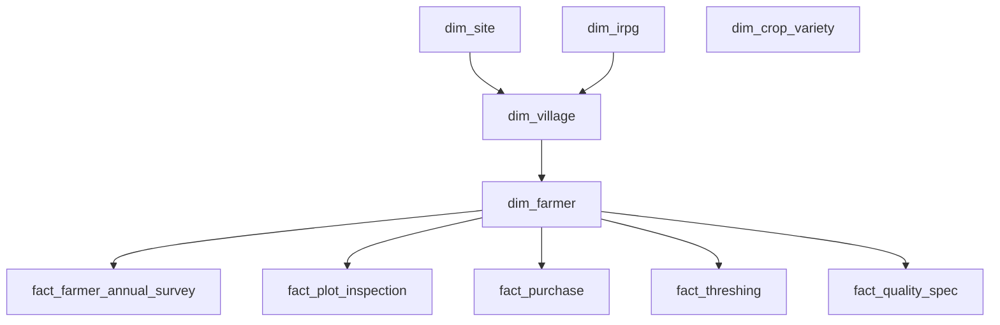

# PostgreSQL Import Order Instructions

To import the normalized CSV files into PostgreSQL successfully, you must load them in a specific order. This ensures that parent rows exist before child rows attempt to reference them via foreign key constraints.

---

## Recommended Import Sequence

Follow this sequence to avoid `foreign key constraint violation` errors:



### Step 1: Independent Dimension Tables (Level 1)
Import these tables first, as they do not depend on any other tables:
1.  **`dim_site.csv`**
    - PostgreSQL Target: `dim_site`
2.  **`dim_irpg.csv`**
    - PostgreSQL Target: `dim_irpg`
3.  **`dim_crop_variety.csv`**
    - PostgreSQL Target: `dim_crop_variety`

### Step 2: Dependent Dimension Tables (Level 2)
Import these tables after the independent dimensions are fully populated:
4.  **`dim_village.csv`**
    - PostgreSQL Target: `dim_village`
    - *Dependencies*: Requires `dim_site` and `dim_irpg` to be loaded first.
5.  **`dim_farmer.csv`**
    - PostgreSQL Target: `dim_farmer`
    - *Dependencies*: Requires `dim_village` to be loaded first.

### Step 3: Fact and Survey Tables (Level 3)
Import these operational tables last, once all dimension keys are established:
6.  **`fact_farmer_annual_survey.csv`**
    - PostgreSQL Target: `fact_farmer_annual_survey`
    - *Dependencies*: Requires `dim_farmer` to be loaded first.
7.  **`fact_plot_inspection.csv`**
    - PostgreSQL Target: `fact_plot_inspection`
    - *Dependencies*: Requires `dim_farmer` to be loaded first.
8.  **`fact_purchase.csv`**
    - PostgreSQL Target: `fact_purchase`
    - *Dependencies*: Requires `dim_farmer` to be loaded first.
9.  **`fact_threshing.csv`**
    - PostgreSQL Target: `fact_threshing`
    - *Dependencies*: Requires `dim_farmer` to be loaded first.
10. **`fact_quality_spec.csv`**
    - PostgreSQL Target: `fact_quality_spec`
    - *Dependencies*: Requires `dim_farmer` to be loaded first.

---

## SQL COPY Import Commands

You can use the native PostgreSQL `COPY` command to import these CSVs quickly. Ensure you run these as a superuser or a user with copy permissions:

```sql
-- Level 1
\copy dim_site FROM 'data_sources/dim_site.csv' WITH (FORMAT csv, HEADER true, ENCODING 'utf8');
\copy dim_irpg FROM 'data_sources/dim_irpg.csv' WITH (FORMAT csv, HEADER true, ENCODING 'utf8');
\copy dim_crop_variety FROM 'data_sources/dim_crop_variety.csv' WITH (FORMAT csv, HEADER true, ENCODING 'utf8');

-- Level 2
\copy dim_village FROM 'data_sources/dim_village.csv' WITH (FORMAT csv, HEADER true, ENCODING 'utf8');
\copy dim_farmer FROM 'data_sources/dim_farmer.csv' WITH (FORMAT csv, HEADER true, ENCODING 'utf8');

-- Level 3
\copy fact_farmer_annual_survey FROM 'data_sources/fact_farmer_annual_survey.csv' WITH (FORMAT csv, HEADER true, ENCODING 'utf8');
\copy fact_plot_inspection FROM 'data_sources/fact_plot_inspection.csv' WITH (FORMAT csv, HEADER true, ENCODING 'utf8');
\copy fact_purchase FROM 'data_sources/fact_purchase.csv' WITH (FORMAT csv, HEADER true, ENCODING 'utf8');
\copy fact_threshing FROM 'data_sources/fact_threshing.csv' WITH (FORMAT csv, HEADER true, ENCODING 'utf8');
\copy fact_quality_spec FROM 'data_sources/fact_quality_spec.csv' WITH (FORMAT csv, HEADER true, ENCODING 'utf8');
```
